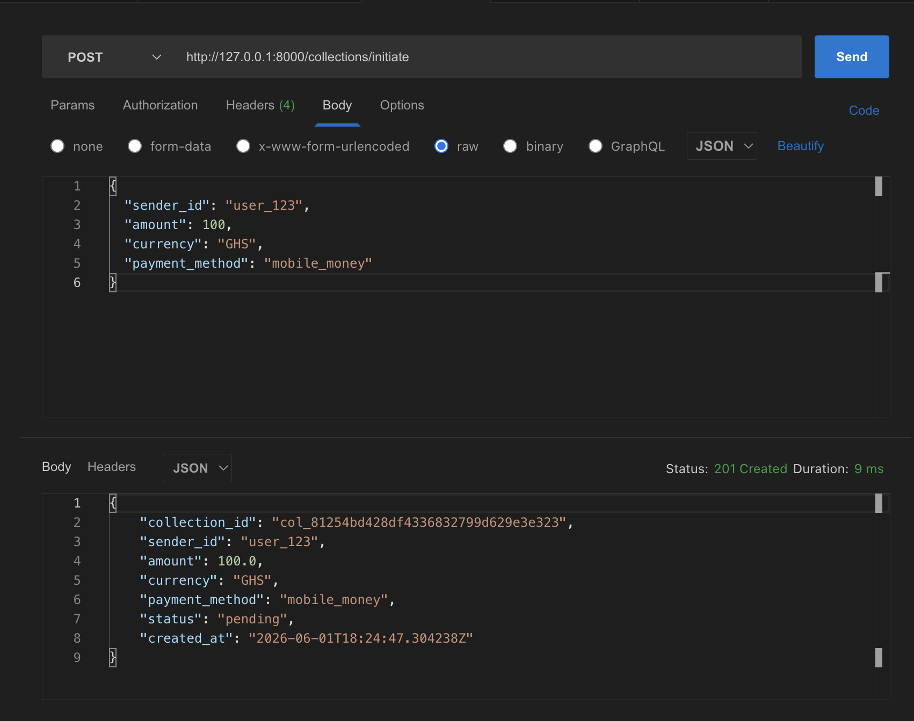
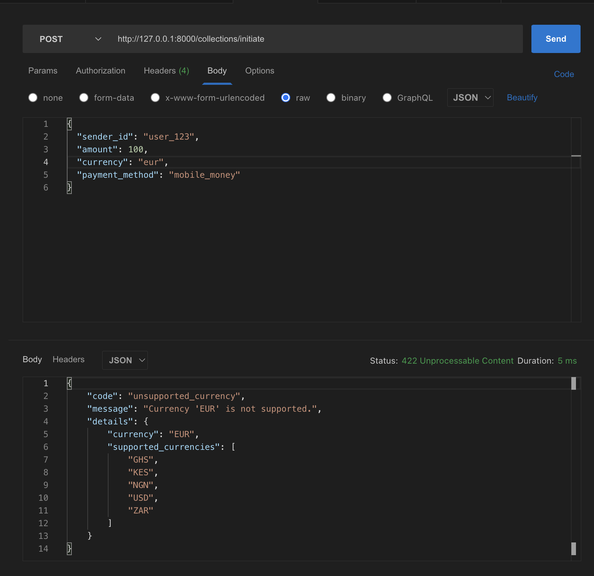
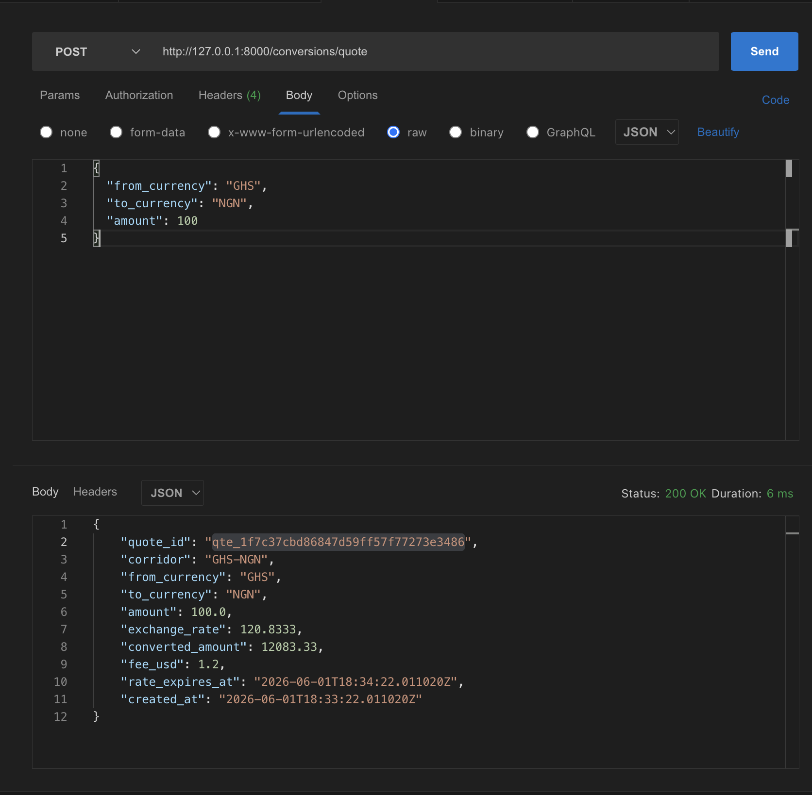
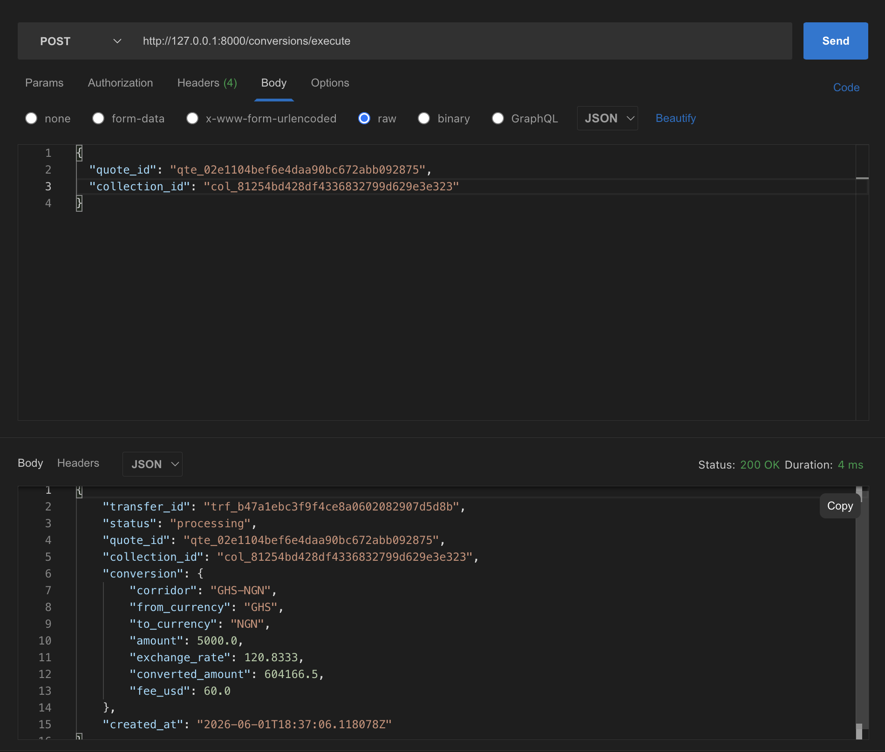

# Transika — Payment Collections & Conversion API

This is my submission for the Transika Software Engineering Intern technical assessment. I built a FastAPI service that handles payment collections and currency conversions — the two core flows described in the brief.

Everything runs in memory (no database). Collection status and quote expiry are simulated using timestamps, which keeps the setup simple but still behaves like a real async payment partner.

---

## What the assessment asked for

### Task 1 — Build the API

Build a REST API in Python (Flask or FastAPI) with **four endpoints**:

| # | Endpoint | What it does |
|---|----------|--------------|
| 1 | `POST /collections/initiate` | Accept `sender_id`, `amount`, `currency`, `payment_method`. Validate fields. Reject unsupported currencies (`GHS`, `NGN`, `KES`, `ZAR`, `USD` only). Return a collection with a generated `collection_id`, `status: pending`, and `created_at`. |
| 2 | `GET /collections/{collection_id}` | Return the collection. Simulate status progression: `pending` → `processing` (after 10s) → `completed` (after 20s). |
| 3 | `POST /conversions/quote` | Accept `from_currency`, `to_currency`, `amount`. Return `quote_id`, `exchange_rate`, `converted_amount`, `fee_usd` (1.2% with $0.50 minimum), `rate_expires_at` (60s from now), and `corridor`. |
| 4 | `POST /conversions/execute` | Accept `quote_id` and `collection_id`. Reject with a **specific error** (not a generic 400) if the quote expired or the collection isn't completed. On success, return `transfer_id`, `status: processing`, and full conversion details. |

**Other requirements:**
- Store collections and quotes in memory (Python dictionaries)
- Every error returns consistent JSON: `code`, `message`, `details`
- Write **5 pytest tests** covering: successful collection, unsupported currency rejection, valid quote, expired quote rejection, and not-completed collection rejection
- README with setup, design decisions, known limitations, and Task 2 answers

### Task 2 — Bug investigation (short answer)

Answer three questions about duplicate transfers on the GH-NG corridor — root cause, two code-level fixes (and deployment order), and how to identify/reverse the 14 affected transfers. No code required. Max 400 words.

My answers are in the [Task 2 section](#task-2--bug-investigation) below.

---

## Quick start

```bash
python3 -m venv .venv
source .venv/bin/activate
pip install -r requirements.txt
uvicorn app.main:app --reload
```

Open **http://127.0.0.1:8000/docs** to try the endpoints interactively.

Run tests:

```bash
pytest -v
```

All 5 required tests should pass.

---

## Endpoints

| Method | Path | Purpose |
|--------|------|---------|
| `POST` | `/collections/initiate` | Start a collection |
| `GET` | `/collections/{collection_id}` | Check collection status |
| `POST` | `/conversions/quote` | Get an FX quote |
| `POST` | `/conversions/execute` | Execute a conversion |
| `GET` | `/health` | Health check |

**Supported currencies:** `GHS`, `NGN`, `KES`, `ZAR`, `USD`  
**Payment methods:** `mobile_money`, `bank_transfer`

Every error response follows the same shape:

```json
{
  "code": "quote_expired",
  "message": "This quote has expired; request a fresh quote before executing.",
  "details": { "quote_id": "qte_...", "rate_expires_at": "..." }
}
```

---

## Project structure

```
app/
  main.py          # FastAPI app, error handlers, router setup
  config.py        # currencies, exchange rates, fee rules, timing
  storage.py       # in-memory dicts
  errors.py        # custom errors + handlers
  schemas.py       # request/response models
  services.py      # business logic
  utils.py         # time and ID helpers
  routers/
    collections.py
    conversions.py
tests/
  conftest.py
  test_api.py      # the 5 required tests
```

---

## Design decisions

I kept the routers thin and put all the logic in `services.py`. That way the rules are easy to test and the HTTP layer doesn't get cluttered.

Collection status isn't stored as a changing field — it's calculated from `created_at` every time you read it. Same idea for quote expiry using `rate_expires_at`. This matches how you'd simulate a slow payment partner without needing background jobs.

For errors, I made separate error classes for each failure (`quote_expired`, `collection_not_completed`, etc.) instead of returning a generic 400. The assessment specifically asked for descriptive errors on execute, and I wanted the same consistency everywhere.

Exchange rates are hardcoded in `config.py`. I used Bank of Ghana interbank mid rates where available and noted the source date there.

---

## Known limitations

- In-memory storage — data is lost when the server restarts
- Using `float` for money (fine for this assessment; production should use `Decimal` or minor units)
- No authentication or rate limiting
- Rates are a snapshot, not live

---

## Tests

The five required tests live in `tests/test_api.py`:

1. Successful collection initiation
2. Unsupported currency rejected
3. Valid conversion quote
4. Expired quote rejected on execute
5. Not-completed collection rejected on execute

```bash
pytest -v
```

---

## Task 2 — Bug investigation

**Bug report:** Duplicate transfers on the GH-NG corridor. A customer taps Send, the app shows a spinner for 8 to 12 seconds, then displays an error saying the transfer failed. But when we check the database, the transfer was actually created successfully, and in some cases it was created twice. Customer support has had to manually reverse 14 transfers this week.

**What we know:** The mobile app retries the API call automatically after 10 seconds if it does not receive a response. The /transfer endpoint does not return any response within that timeout window during high load. The database has no unique constraint on (sender_id, amount, recipient_id, created_at).

---

### 1. What is causing the duplicate transfers?

When a customer taps Send, the mobile app sends one POST request to /transfer. Under high load, the backend is slow. It actually creates and saves the transfer in the database, but the HTTP response does not get back to the app in time.

After 10 seconds, the app automatically sends the same request again because it assumes the first one failed. The server treats this second request as a brand new transfer. There is no idempotency check, and nothing in the database stops the duplicate insert. So a second row gets created.

From the customer's side, they tapped once and saw an error. From the system's side, the money already moved. In the worst cases, it moved twice.

---

### 2. Two code level fixes and the order I would deploy them

The first fix I would implement is idempotency keys at the API layer. Each time a customer taps Send, the app generates a unique key and sends it with the request, for example as an Idempotency-Key header. The server stores that key together with the transfer result. If the same key comes in again, the server returns the original result instead of creating a new transfer.

The second fix is a database unique constraint on that idempotency key. This is a safety net so that even if something slips through the API layer, the database still rejects a duplicate insert.

I would deploy the idempotency fix first. It makes retries safe straight away without making things worse for the user. If you add the database constraint first while the app is still retrying blindly, duplicate inserts will start throwing database errors that surface as 500 responses. That makes the customer experience worse, not better. You also need to clean up the 14 existing duplicates before adding a strict constraint, otherwise the migration will fail on dirty data.

---

### 3. How I would identify and reverse the 14 affected transfers

To find all affected transactions, I would query every transfer on the GH-NG corridor during the incident window. I would group them by sender_id, amount, and recipient_id and look for groups with more than one record. I would then narrow it down to groups where the created_at timestamps are within about 10 seconds of each other, since that matches the retry window. If request logs are available, I would cross check those to confirm it was the same user action and not two separate sends.

For the reversal process, I would first pause new transfers on that corridor and temporarily disable auto retry in the app. For each duplicate group, I would keep the earliest transfer as the valid one and reverse the extras. Before reversing anything, I would check with the mobile money partner whether the payout has already gone out. If it has not settled yet, void it. If it has already been paid, run an idempotent reversal tied back to the original transfer. I would refund any fees that were charged twice, mark reversed rows clearly in the database so nothing gets reversed twice, and only turn the corridor back on once the ledger balances check out.

---

## Appendix — Postman test results

I also tested the endpoints manually in Postman while the server was running locally. Screenshots below.

### POST /collections/initiate — success



### POST /collections/initiate — unsupported currency



### POST /conversions/quote — success



### POST /conversions/execute — success



---

## AI assistance

The code implementation was developed with assistance from an AI coding assistant (Cursor) — mainly for boilerplate, syntax, and speeding up repetitive parts.

The architecture, project structure, business-rule decisions (status timing, fee calculation, error handling approach, exchange rate choices), and all Task 2 answers were written and decided by me. I reviewed and tested everything locally using pytest and Postman before submitting.
